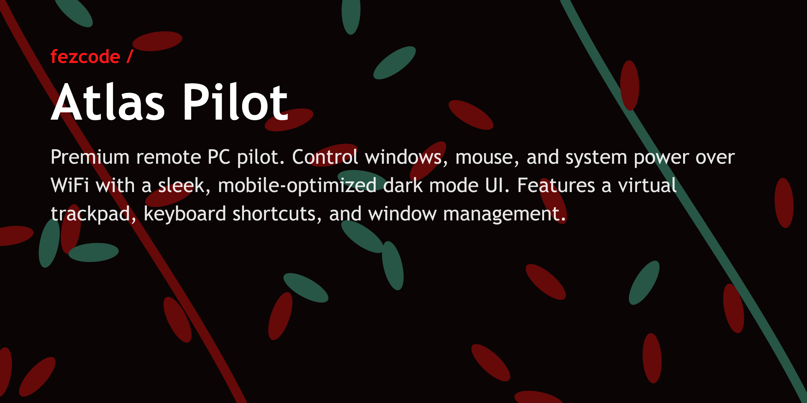
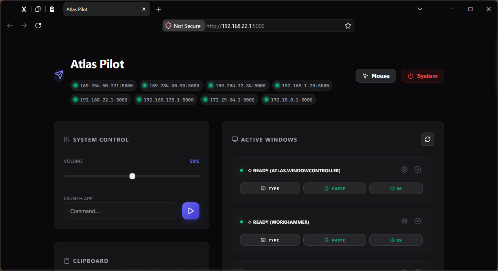
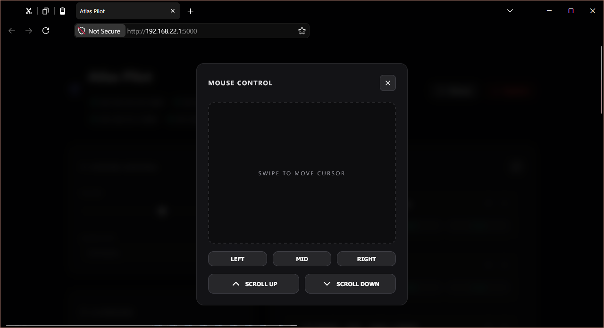
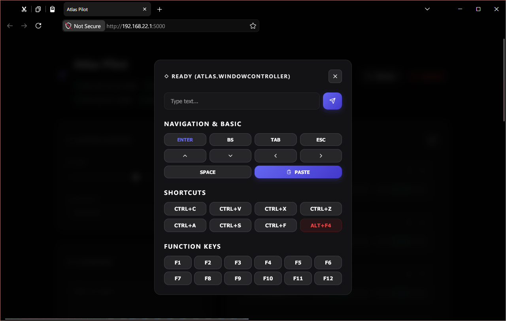

# ✈️ Atlas Pilot



> **Premium remote PC pilot.** Steering your computer from your pocket has never looked this good.

Atlas Pilot is a sophisticated, mobile-optimized remote control center for your PC. Built for the **Atlas Suite**, it provides a high-performance bridge between your phone and your desktop over Wi-Fi, wrapped in a premium Sleek Dark UI.

---

## ✨ Key Features

### 🖥️ Window Management
- **Centralized Command**: View all active windows with one-tap focus.
- **Smart Snapping**: Position windows perfectly (corners, halves, fullscreen).
- **State Control**: Maximize or minimize any window remotely.
- **Multi-Monitor Support**: Beam windows between monitors with a single click.

### 🖱️ Virtual Trackpad
- **Smooth Navigation**: Use your phone screen as a highly responsive trackpad.
- **Full Mouse Support**: Dedicated buttons for Left, Right, and Middle clicks.
- **Precise Scrolling**: Tactile scroll buttons for effortless document and web navigation.

### ⌨️ Remote Keyboard & Hotkeys
- **Full Text Input**: Type directly into any focused window from your phone.
- **Shortcut Hub**: Send common hotkeys like `Ctrl+C`, `Ctrl+V`, `Ctrl+Z`, `Alt+F4`, and more.
- **Function Keys**: Complete `F1-F12` row support for advanced apps and games.

### 📋 Universal Clipboard
- **Bi-directional Sync**: Pull text from your PC to your phone or push your phone's clipboard to your PC.
- **Quick Paste**: Push text and trigger a `Ctrl+V` command in one seamless action.

### 📸 Instant Feedback
- **Live Screenshots**: Snap a quick preview of any controllable window to see its current state.

### 🔌 OS & System Control
- **Power Management**: Remotely Shutdown, Restart, Sleep, or Lock your PC.
- **Safe Actions**: Built-in confirmation system to prevent accidental shutdowns.
- **Volume Tuning**: Smooth slider control for system-wide audio.

---

## 📸 Gallery

<p align="center">
  
  
  
</p>

---

## 🚀 Quick Start

### 1. Run the Pilot
Launch the application on your PC. It will automatically detect your local IP addresses.
```powershell
.\atlas.pilot.exe
```

### 2. Connect
Open the provided URL (e.g., `http://192.168.1.50:5000`) on your mobile browser.

### 3. Take Control
No internet required! As long as you're on the same Wi-Fi, you're the pilot.

---

## 🛠️ Build from Source

Uses `gobake` for orchestration:

```powershell
gobake build
```

---

## 📦 Project Info
- **Version**: 0.5.4
- **License**: MIT
